  

  

  
  
  

---

## 👋 About Me

- 🧩 I make small, focused apps and browser tools **as a hobby**
- 📓 My repositories are a **memo of things I've made**
- 🇯🇵 Based in Japan — some repos are written in Japanese

## 🛠️ Skills & Tools

  

  

## 🧰 Web Tools

  
  
  

  
  

  
  

  
  

  
  

  
  

## 📊 GitHub Stats

  
  

  

